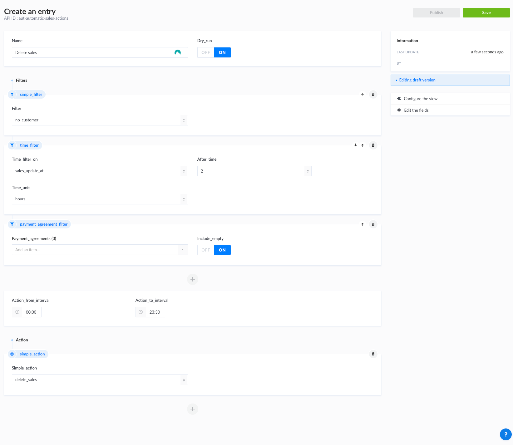

## About

Automated sales actions are a set of actions that are executed based on certain filters. The way this flow works is by selecting one or more filters and one actions. There's an internal timer that will run the action every hour and will execute it on the filtered sales.

## Types of actions

At the moment, the following actions are supported:

1. **Close sale**
2. **Cancel sale**
3. **Accept invoice** - gets all the invoices from the sales order and accept them while closing the order.
4. **Accept invoice and close sale** - same as 3. but it closes also the sale

## Types of filters

Filter by List of simple filters:

1. No dimension
2. No notes
3. No customer
4. No product
5. No resource reservations
6. No accommodation reservations
7. No pending checkouts
8. All orders paid
9. All orders closed
10. Sales is ended

Filter by sales state

1. Cancel process
2. Cancelled
3. Closed
4. Confirmed
5. Draft
6. Open
7. Temporal

Filter by sales facet: you can choose from the sales facet defined by your organization.

Filter by payment agreement: you can choose from the payment agreement defined by your organization.

Filter by checked tasks: you can choose from the checked tasks defined by your organization.

Filter by time

1. Sales updated at: after what period of time compared to when the sales was last updated
2. Sales end: after what period of time compared to when the sales was ended
3. External payment creation time: after what period of time compared to when the external payment for that sale was created

You must at at least one filter for a sales action, it it recommended to add as many as you would need to isolate the desired sales.

## Additional info

**Dry-run**

- If true: the action will run, but it won't save the result. E.g action should delete 10 sales, but it won't delete them. This feature is used when wanting to see what sales will be effected.
- If false: it will execute the actual action.

**Action from and to interval**

- As stated before, there is a timer that runs every hour and execute the actions. If you want your action to be executed during the night, then you will have to setup like the following:
  - Action from interval: 00:00
  - Action to interval: 06:00

## Example

